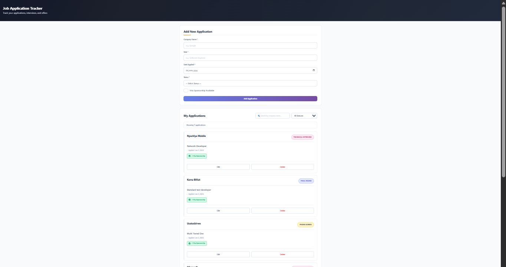
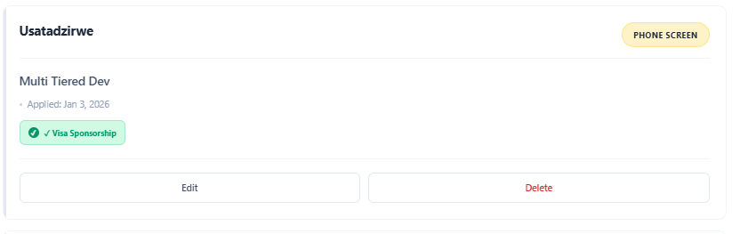
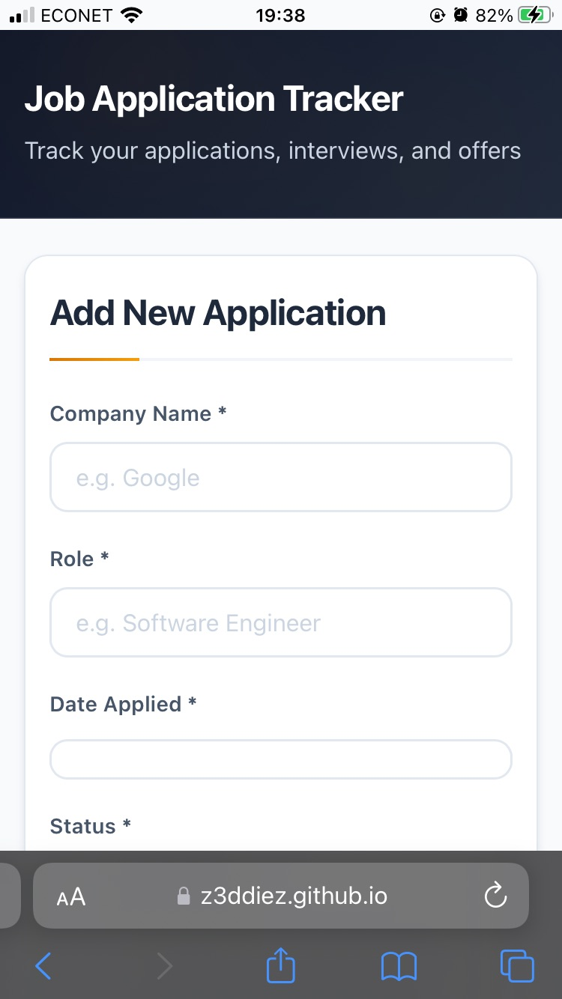

# Job Application Tracker

A modern, full-stack web application for managing job applications and interview processes. Built with TypeScript, Vite, and Firebase Realtime Database. A data-driven job search assistant and personal productivity platform.

## 🚀 Live Demo

**[View Live Application](https://z3ddiez.github.io/Job-Tracker-Zawadi/)**

## 📸 Screenshots

### Dashboard


### Application Management


### Mobile Responsive


## ✨ Features

### Core Functionality
- **Full CRUD Operations** - Create, read, update, and delete job applications
- **Real-Time Syncronisation** - Instant updates across all devices using Firebase Realtime Database
- **Advanced Search & Filter** - Find applications quickly by company name or status
- **Status Tracking** - Monitor progress in 6 stages: Applied → Phone Screen → Technical Interview → Final Round → Offer/Rejected
- **Visa Sponsorship Flag** - Track which companies offer visa sponsorship

### Analytics & Insights (v2.1.0+)
- **Analytics Dashboard** - Comprehensive data visualization and insights
- **Status Distribution** - Visual breakdown of applications by status
- **Key Metrics** - Success rate, response rate, and application velocity
- **Multiple View Modes** - Cards, Table, and Analytics views
- **Pagination** - Efficiently handle large datasets (100+ applications)

### User Experience
- **Clean UI/UX** - Professional, minimal design with earthy color palette
- **Responsive Design** - Optimized for desktop (1920px), tablet (768px), and mobile (375px)
- **Smooth Animations** - Subtle transitions and feedback for all interactions
- **Persistent Storage** - Data saved securely in Firebase Realtime Database
- **Multiple View Modes** - Cards, Table, and Analytics dashboard views
- **Pagination** - Efficient handling of large datasets (100+ applications)

## 🛠️ Tech Stack

**Frontend:**
- HTML5 - Semantic Markup
- CSS3 (Custom properties, Grid, Flexbox, animations)
- TypeScript - Type-safe development
- Vanilla JavaScript (ES6+, async/await, Promises)

**State Management:**
- Nanostores - Lightweight, reactive state management

**Build Tools:**
- Vite - Fast build tool and dev server
- TypeScript Compiler - Type checking and compilation

**Backend:**
- Firebase Realtime Database (NoSQL, real-time sync)
- Firebase Hosting (Path-based access control)

**Development:**
- Git & GitHub
- GitHub Pages (deployment)
- ESLint & Prettier - Code quality
- Vitest - Testing framework

**Design System:**
- CSS Custom Properties
- Mobile-first responsive design
- Monochrome colour palette with terra cotta accents

## 🎯 Why I Built This

As a CS student applying to 80+ companies for graduate roles, I needed a centralized system to:
- Track all applications in one place
- Monitor interview stages across multiple companies
- Identify which companies offer visa sponsorship
- Analyze my application success rate

This project solved my own problem while demonstrating full-stack development skills.

## 🆕 Recent Updates

### Version 2.1.1 - Security Enhancements (Latest)
- ✅ **Security Audit** - Comprehensive OWASP Top 10 review
- ✅ **XSS Prevention** - All user input properly sanitized and escaped
- ✅ **Input Validation** - Enhanced validation with length limits and pattern detection
- ✅ **Rate Limiting** - Client-side throttling to prevent abuse
- ✅ **Security Logging** - Event tracking for suspicious activities
- ✅ **Secure Firebase Operations** - Path validation and whitelisting
- ✅ **Content Security Policy** - CSP headers for additional protection

### Version 2.1.0 - Analytics Foundation
- ✅ **Analytics Dashboard** - Data visualization and insights
- ✅ **Status Distribution Chart** - Visual breakdown of application statuses
- ✅ **Statistics Cards** - Key metrics at a glance (total apps, success rate, response rate)
- ✅ **View Modes** - Switch between Cards, Table, and Analytics views
- ✅ **Pagination** - Handle large datasets efficiently (100+ applications)
- ✅ **Real-time Analytics** - Metrics update automatically as data changes

### Version 2.0.0 - TypeScript Migration & Modern Tooling
- ✅ **TypeScript Integration** - Full type safety and better developer experience
- ✅ **Vite Build Tool** - Lightning-fast development and optimized production builds
- ✅ **State Management** - Nanostores for predictable, reactive state updates
- ✅ **Modular Architecture** - Clean separation of concerns with organized utilities
- ✅ **Testing Setup** - Vitest configured with example tests
- ✅ **Code Quality** - ESLint and Prettier for consistent code style
- ✅ **Environment Variables** - Secure configuration management

**Note**: Minor AI assistance was used for initial TypeScript setup and project structure organization. All architectural decisions and implementation were made by the developer.

## 💡 What I Learned

### Technical Skills
- Building responsive UIs without frameworks
- Working with Firebase Realtime Database
- Implementing CRUD operations with real-time sync
- TypeScript for type-safe development
- Modern build tools (Vite) and state management
- Creating reusable, modular code architecture
- Testing with modern frameworks

### Soft Skills
- Breaking down complex problems into smaller tasks
- Designing user-centric interfaces
- Writing clean, maintainable code
- Deploying production-ready applications
- Progressive enhancement and migration strategies

## 🚦 Getting Started

### Prerequisites
- Node.js (v18 or higher) and npm
- A modern web browser (Chrome, Firefox, Safari, Edge)
- Firebase account (for your own deployment)

### Local Development

1. **Clone the repository**
```bash
   git clone https://github.com/Z3DDIEZ/Job-Tracker-Zawadi.git
   cd Job-Tracker-Zawadi
```

2. **Install dependencies**
```bash
   npm install
```

3. **Set up Firebase** (Optional - uses fallback config if not set)
   - Create a Firebase project at [console.firebase.google.com](https://console.firebase.google.com)
   - Enable Realtime Database
   - Create a `.env` file in the root directory:
   ```env
   VITE_FIREBASE_API_KEY=your_api_key
   VITE_FIREBASE_AUTH_DOMAIN=your_auth_domain
   VITE_FIREBASE_DATABASE_URL=your_database_url
   VITE_FIREBASE_PROJECT_ID=your_project_id
   VITE_FIREBASE_STORAGE_BUCKET=your_storage_bucket
   VITE_FIREBASE_MESSAGING_SENDER_ID=your_sender_id
   VITE_FIREBASE_APP_ID=your_app_id
   ```

4. **Start development server**
```bash
   npm run dev
```
   - Server starts at `http://localhost:3000`
   - Hot reload enabled for instant updates
   - **Important**: Use the dev server URL, don't open `index.html` directly

5. **Start adding applications**
   - Fill out the form
   - Watch real-time updates
   - Test all CRUD operations

### Building for Production

```bash
npm run build
```

This creates an optimized `dist/` folder ready for deployment to GitHub Pages or any static host.

## 📁 Project Structure
```
Job-Tracker-Zawadi/
├── src/                    # Source code (TypeScript)
│   ├── main.ts            # Application entry point
│   ├── types/             # TypeScript type definitions
│   ├── stores/            # State management (Nanostores)
│   ├── services/          # Business logic (analytics, etc.)
│   ├── components/        # UI components
│   │   ├── charts/       # Chart components (Chart.js)
│   │   └── stats/        # Stat card components
│   ├── utils/             # Utility functions
│   │   ├── validators/   # Input validation
│   │   ├── security/     # Security utilities
│   │   ├── filters/      # Filtering logic
│   │   ├── sorting/      # Sorting logic
│   │   └── pagination/   # Pagination utilities
│   └── config/            # Configuration files
├── public/                 # Static assets
│   ├── favicon.svg       # App icon
│   └── .htaccess         # Security headers
├── index.html             # Main HTML structure
├── style.css              # Complete styling with CSS variables
├── screenshots/           # Application screenshots
├── AI Markdown Assistance/ # Documentation and guides
├── package.json           # Dependencies and scripts
├── tsconfig.json          # TypeScript configuration
├── vite.config.ts         # Vite build configuration
└── README.md              # This file
```


## 🔐 Security Notes

- Firebase API keys are public by design (frontend apps)
- Security enforced through Firebase Security Rules
- Only allows read/write to "applications" path
- No authentication required for personal use
- For production with multiple users, add Firebase Authentication

## 🎨 Design Philosophy

**Earthy Monochrome Palette:**
- Primary: Slate grays (#0f172a to #f8fafc)
- Accent: Warm terra cotta (#d97706)
- Semantic: Subtle pastels for status indicators

**Modern CSS Techniques:**
- CSS Custom Properties (variables)
- CSS Grid for layout
- Flexbox for components
- Smooth transitions and animations
- Mobile-first responsive design

## 🚀 Roadmap

### Phase 2 - Data Visualization & Analytics (In Progress)

**v2.2.0 - Advanced Visualizations** (Next)
- [ ] Application funnel chart (Applied → Offer conversion)
- [ ] Weekly application velocity (line chart)
- [ ] Time-in-status metrics (bar chart)

**v2.3.0 - Analytics Dashboard Enhancement**
- [ ] Interactive chart filtering
- [ ] CSV export functionality
- [ ] PNG export for charts
- [ ] Enhanced insights and recommendations

**v2.4.0 - Behavioral Analytics**
- [ ] User behavior event tracking
- [ ] Drop-off point analysis
- [ ] Optimal application timing insights
- [ ] Visa sponsorship impact analysis

### Future Phases

**Phase 3 - Motion & Animations**
- [ ] Motion One integration
- [ ] Smooth transitions
- [ ] Status change animations

**Phase 4 - Backend Intelligence**
- [ ] Firebase Authentication (multi-user support)
- [ ] Firebase Cloud Functions
- [ ] Email reminders
- [ ] Automated tagging

**Phase 5 - Production Polish**
- [ ] PWA support (Service Worker)
- [ ] Offline functionality
- [ ] Installable app
- [ ] Performance optimizations

## 📝 License

This project is open source and available under the [MIT License](LICENSE).

## 👤 Author

**Zawadi MC Nyachiya**
- GitHub: [@Z3DDIEZ](https://github.com/Z3DDIEZ)
- LinkedIn: [Zawadi MC Nyachiya](https://www.linkedin.com/in/zawadi-nyachiya-166164204)
- Email: [nyachiya.zawadi@gmail.com](mailto:nyachiya.zawadi@gmail.com)


## 🙏 Acknowledgments

- Firebase for excellent real-time database
- GitHub Pages for free hosting
- The tech community for inspiration and resources

## Project Status

**Current Version**: 2.1.1  
**Active Development**: Yes  
**Current Phase**: Phase 2 - Data Visualization & Analytics (In Progress)

### Completed
- ✅ **Phase 1** - Foundation Layer (v2.0.0)
  - TypeScript migration
  - Modern tooling (Vite, Nanostores)
  - Modular architecture
- ✅ **v2.1.0** - Analytics Foundation
  - Analytics dashboard
  - Status distribution chart
  - Statistics cards
  - View modes (Cards/Table/Analytics)
  - Pagination
- ✅ **v2.1.1** - Security Enhancements
  - Security audit
  - XSS prevention
  - Input validation
  - Rate limiting

### In Progress
- 🚧 **v2.2.0** - Advanced Visualizations
  - Application funnel chart
  - Weekly velocity chart
  - Time-in-status chart

### Planned
- 📋 **v2.3.0** - Analytics Dashboard Enhancement
- 📋 **v2.4.0** - Behavioral Analytics


**Built with ❤️ by Zawadi |Johannesburg, South Africa**
